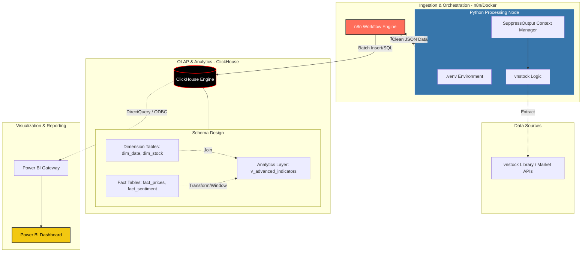

# Stock
This project provides a robust Python-based integration for the vnstock library within n8n. It is designed to automate the retrieval of Vietnamese stock market data while maintaining compatibility between local development environments (VS Code) and production environments (n8n/Docker)

## Deployment (Docker)
To spin up n8n with the pre-configured Python environment:
```Bash
docker compose build --no-cache
docker compose up -d
```

## Architecture


## Clickhouse Setup

### OLAP Tables Structure

#### Dimension Tables (Descriptive Data)
1. **dim_date (Calendar Dimension)**: A specialized calendar table that allows for time-series analysis across non-standard dimensions like trading vs. non-trading days, fiscal quarters, and day-of-week performance.
2. **dim_stock (Stock Profile)**: Stores company metadata. Use ReplacingMergeTree so that when n8n rescans the market, it updates existing records with the latest info.

#### Fact Tables
1. **fact_stock_prices (Market Price & Volume)**: The central repository for Daily OHLCV (Open, High, Low, Close, Volume) data. Physically sorted by symbol and trade_date to make calculating SMA, EMA, and CMF lightning-fast.
2. **fact_market_sentiment (Capital Flow)**: Tracks institutional and foreign movement to gauge market sentiment.

#### Analytics Layer (Automated Calculations)
1. **v_advanced_indicators**: An abstraction layer that standardizes complex technical analysis. This view automates the calculation of rolling metrics such as Simple Moving Averages (SMA), Chaikin Money Flow (CMF)... By encapsulating intricate Window Functions, it provides a "plug-and-play" interface for BI tools and reports, ensuring consistent indicator logic across the entire ecosystem without the need for repetitive, manual computations.

### Create Tables
- Run all the scripts inside folder `clickhouse_query\create_table` and `clickhouse_query\create_analytics_layer`
- Create tables in order: dim tables, fact tables, analytics layer.

### Import seed data
- Import seed data for `dim_table` using `clickhouse_seed_data\stock_seed_data.csv`

## n8n Setup 

### Local Development & Testing
Follow these steps to debug and test your scripts locally before deploying them to your workflow.

#### Virtual Environment
- Install Virtual Environment:
```Bash
python -m venv .venv
```
- Activate Virtual Environment:
```Bash
.venv\Scripts\activate
```

#### Install packages
```Bash
pip install -r requirements.txt
```

#### Create test script
Copy Node Script code inside `my_n8n_logic` function

#### Run test
The `test_bench.py` script imports the logic from your main script and outputs the result in a clean JSON format:
```Bash
python test_bench.py
```

### Import workflows
Import all workflows in folder `n8n_workflows`

### Preventing JSON Output Corruption in n8n Python Scripts

#### Handling n8n's Communication Logic
- Automation platforms like n8n expect a very specific JSON format as the final output of a script. If a library (like `vnstock`) prints any "Welcome" messages, logs, or progress bars to the console, it corrupts the JSON output, causing the n8n node to crash.
- Solution: Wraps the logic to ensure that only the final returned list of dictionaries is captured as the result.
- The Return Format: Returning {"json": {"symbol": sym}} matches exactly what n8n needs to process items in a workflow.

#### The SuppressOutput Context Manager
- This is the most critical part of the design. Many financial libraries print metadata or "Powered by..." messages upon being imported.
```Python
    class SuppressOutput:
        def __enter__(self):
            self._original_stdout = sys.stdout
            self._original_stderr = sys.stderr
            self._devnull = open(os.devnull, 'w', encoding='utf-8')
            sys.stdout = self._devnull
            sys.stderr = self._devnull
        def __exit__(self, exc_type, exc_val, exc_tb):
            sys.stdout = self._original_stdout
            sys.stderr = self._original_stderr
            self._devnull.close()

    with SuppressOutput():
        from vnstock import Listing
        listing = Listing()
        symbols_list = listing.symbols_by_group(input_group).to_list()
    
    return [{"json": {"symbol": sym}} for sym in symbols_list]
```
- `os.devnull`: This acts as a "black hole." By redirecting `sys.stdout` and `sys.stderr` here, any text printed by the vnstock library is discarded.
- Encapsulation: It ensures that "noise" from the library doesn't interfere with the "signal" (your data).
- Restoration: The `__exit__` method restores the original settings so that the final `print()` at the very bottom of the script actually works.

#### Character Encoding Strategy
```Python
sys.stdin.reconfigure(encoding='utf-8')
```
- Since you are dealing with Vietnamese stocks and potentially Vietnamese company names, standard ASCII encoding might fail.
- UTF-8 Safety: Reconfiguring the standard streams ensures that the script can handle Vietnamese characters without throwing UnicodeEncodeError.

#### Efficient Data Mapping
- The list comprehension `[{"json": {"symbol": sym}} for sym in symbols_list]` transforms a flat list of stock tickers into an array of objects.
- n8n Compatibility: This allows n8n to treat each stock symbol as an individual "item," enabling you to loop through them in subsequent nodes (like getting prices for each stock).

## Power BI

## Connect to Clickhouse

**Step 1: Install the Clickhouse ODBC Driver**
1. Go to the ClickHouse ODBC Github Releases.
2. Download the 64-bit MSI installer (e.g., clickhouse-odbc-1.1.10-win64.msi).
3. Install it on the Windows machine where Power BI Desktop is located.

**Step 2: Configure the Windows DSN** - This step tells Windows exactly where your ClickHouse server lives.
1. Open ODBC Data Source Administrator (64-bit) on your PC.
2. Go to the *System DSN* tab and click *Add*.
3. Select *ClickHouse Unicode* and click *Finish*.
4. Fill in the configuration:
    - Name: `ClickHouse_Stock`
    - Host: `localhost` (if using Docker locally) or your Server IP.
    - Port: `8123` (Standard HTTP port for ClickHouse).
    - Database: `n8n_olap`.
    - User: `default` (unless you changed it).
5. Click *Test* to ensure it says "Success."

**Step 3: Connect Power BI to the DSN** - Now, open Power BI Desktop to pull the data.
1. Click *Get Data* > *More...* > Search for ODBC.
2. In the Data source name (DSN) dropdown, select `ClickHouse_Stock`.
3. Storage Mode (Critical Decision):
    - Import: Use this for `dim_stock` and `dim_date`. It loads the data into RAM for lightning-fast filtering.
    - DirectQuery: Use this for your `v_indicators_base` View. Power BI will send the SQL queries directly to ClickHouse so your PC doesn't have to calculate the SMA/RSI math.
5. Select your tables and click Load.

### Other configuration

**Disabling Column Aggregation (Set Summarization to “Do not summarize”)**
1. Change to *Table View*
2. Select a column (e.g. close, sma_20, ema_20)
3. Go to *Column tools* -> Find *Summarization* -> Choose *Do not summarize*

**Create Relationship Between Dim Tables and Fact Tables - Which Clikhouse does not have**
1. Change to *Model View*
2. On menu, click *Manage relationships*

### Core Visualizations & Layout
1. **Technical Trend Analysis (The Main Chart)**:
    - Visual: Line and Column Chart or a specialized Candlestick custom visual.
    - X-axis: `trade_date`
    - Y-axis: `close`, `ema`, `sma`, `rsi`, `cmf`, `volume`...
2. **Filter Analysis**: Use Slicer to analyse which stock should be buy 

## Workflows

### Seed data
1. **dim_stock**: Import data from `clickhouse_seed_data\stock_seed_data.csv` to clickhouse
2. **dim_date**: Run n8n workflow `n8n_workflows\Stock__Seed_Dim_Date.json`
3. **fact_stock_prices**: Run n8n workflwo `n8n_workflows\Stock__Seed_Price_Data.json`

### Get data - Visualize using Power BI
Run the following query:
```SQL
SELECT * FROM n8n_olap.v_indicators_base 
WHERE symbol = 'BTC/USDT'
ORDER BY trade_date DESC;
```